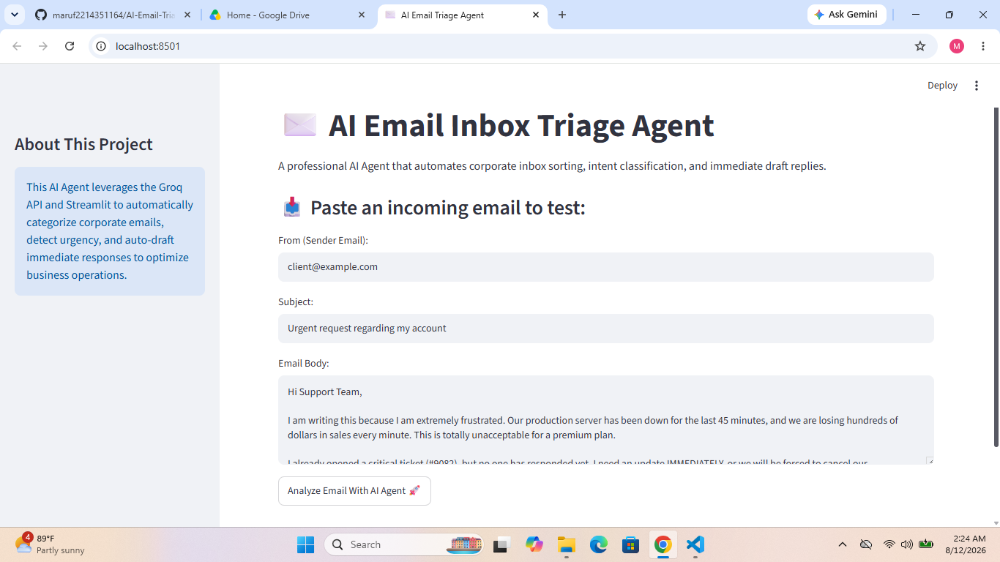
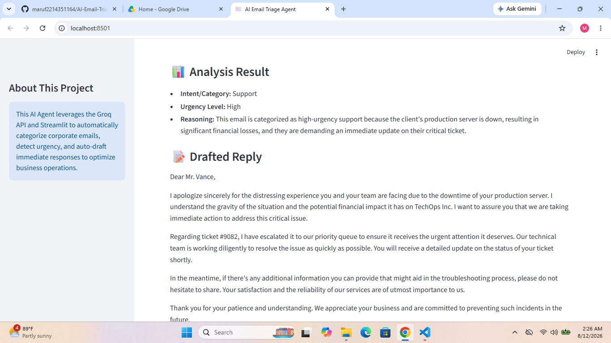
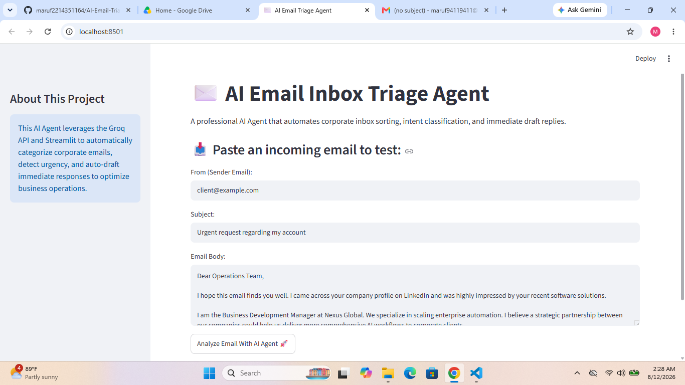
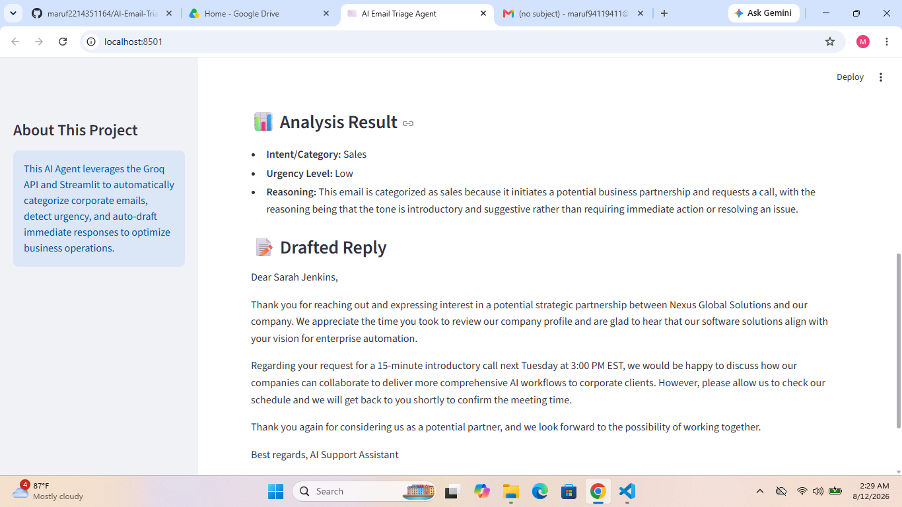

# AI Email Inbox Triage Agent 🤖💼

An automated, enterprise-ready AI solution that scans corporate inboxes, classifies intent, detects urgency, and drafts professional immediate responses. This optimizes business operations by saving hours of manual inbox management.

## 🛠️ Tech Stack
- **Language:** Python
- **Framework:** Streamlit
- **LLM/API:** Groq API (Llama 3.3)

---

## 🎬 Live Project Demo
👉 [Watch the 1-Minute Demo Video on YouTube](https://youtu.be)

---

## 📸 Core Features & Live Preview

### 🔹 Case 1: Urgent Customer Support (Angry Client)
* **Input Preview:** Automated sorting captures the high-friction language.

* **Output Preview:** Intent is correctly classified as *Support*, Urgency is marked as *High*, and a polite corporate reply is drafted instantly.

---

### 🔹 Case 2: Business & Sales Inquiry (Strategic Partnership)
* **Input Preview:** Capturing potential leads or partnership pitches automatically.

* **Output Preview:** Classified as *Sales/Inquiry*, Urgency marked as *Medium*, and an automated calendar/follow-up response draft is generated.

